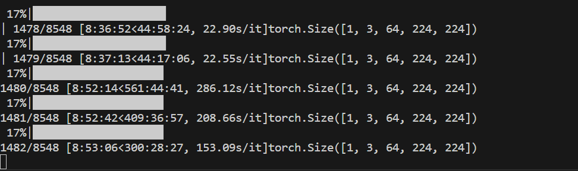

# 中期报告

## 选题：结合视频和音频信息完成分类任务

### 具体内容：论文复现

Vision Transformers are Parameter-Efficient Audio-Visual Learners.

一篇关于ViT的论文。

研究仅在视觉数据上训练的ViT如何通过LAVISH适配器，在不改变原本ViT参数的情况下，来实现视觉-音频的融合任务。

原论文是在三个类型上评估的：

AVE： Au+dio-visual event localization

AVQE：Audio-Visual Question Answering

AVS：Audio-Visual Segmentation

我们要将LAVISH用在视频动作分类上。

## 进展情况

### 数据集准备

使用UCF-101数据集，一个包含了13320个视频，101个分类标签的数据集。

### 预处理pipeline

参考了https://github.com/Alexyuda/action-recognition-video-audio的工作方式。

因为要使用音频，所以筛选了带音频的videos，转化格式为224*224，20帧的视频。

最后得到了8548+3260=11808个数据（按照默认的训练集和测试集划分）

随后对每个数据切分，每64帧作为一个clip，每隔64帧取一个（无重叠）

### Baseline准备

### repo action-recognition-video-audio自带

数据集自带了i3d，soundnet+i3d，i3d+soundnet+attention三种识别，所以我们都跑了一下。

可以看到在这三种方式下效果就特别好了，top1都在0.9+,top5都在0.98+。

随后我们准备正式的baseline。

用VIT分别在不同模态和模态混合的情况下来跑。

但这里的问题是，训练非常慢，在之前的参数设置下（3\*64\*224\*224)，为了不爆电脑3050ti的显存，batch_size只能设置为1，这样一个epoch要跑大概3天。

现在在考虑要不要减少clip的长度，从而增大batchsize。
